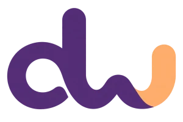

<p align="center">
  
</p>

<h1 align="center">dowitme</h1>
<p align="center"><strong>Documents, spreadsheets and presentations. Made together by people and AI.</strong></p>
<p align="center"><a href="https://bento-office-davide.davidemori.chatgpt.site/">Open dowitme</a></p>

## A shared workspace for people and agents

dowitme brings text documents, spreadsheets and presentations into one web workspace. Organize files in personal spaces and folders, share access with other people, and let external AI agents work on the same structured content you edit.

Agent collaboration happens inside the document workflow: precise changes, reviewable proposals, an attributed history and safe undo. It is more than a chat beside an editor.

## What you can do

- **Write documents:** edit structured text, paragraphs and tables with the native document editor.
- **Work with spreadsheets:** edit cells, use formulas, explore datasets and create charts. Typing `=` opens function suggestions with autocomplete and contextual syntax help.
- **Create presentations:** compose slides with text, images, shapes and other native elements.
- **Organize and share:** keep files in personal spaces and folders, with owner, editor and viewer roles and inherited folder permissions.
- **Collaborate with agents:** connect external clients through MCP, or use WebMCP in supported browsers. Delegate read access, proposals only or direct edits, with expiring, revocable agent credentials.
- **Review and reverse changes:** inspect authors and before/after values, accept or reject proposals, and undo changes without silently overwriting incompatible later edits.
- **Take your work with you:** export self-contained HTML documents. Spreadsheets also reuse bento's CSV and Excel import/export capabilities, within their supported limits.

## Inspired by bento — built on bento

[**bento by nyblnet**](https://github.com/nyblnet/bento) is both the inspiration and the concrete technical foundation of dowitme. This repository is a fork, not a from-scratch replacement.

We reuse bento's native editors, structured document models, formula and chart engines, and self-contained HTML format. dowitme adds a shared web workspace, personal file organization, permission-aware persistence, and a common transaction layer for people and external agents.

The original bento authors' copyright, MIT license and third-party notices are preserved. The `bento/*` document formats and `#bento-doc` block remain intact for compatibility; the interface uses the dowitme identity.

## Working with AI agents

Open a file and use **Agents** to create a delegated connection. Choose its permission and expiration, then configure your MCP client with the endpoint and credential shown in the app. Credentials are displayed once and can be revoked.

The remote MCP endpoint is `/api/mcp`, with `/mcp` as an alias. Clients using delegated credentials send `Authorization: Bearer <agent-key>`. Never commit or share an agent key publicly.

Tools expose document structure and stable identifiers for cells, blocks, slides and elements. Agents can read content, propose edits, inspect history and—when explicitly delegated—apply or undo changes. The server validates permissions and revisions for each operation. WebMCP exposes the shared tool definitions in browsers that support it.

## Run locally

Use Node.js 24 (see [`.nvmrc`](.nvmrc)) and npm 11. All editors are npm workspaces: install once at the repository root.

```sh
git clone https://github.com/davide-relaunchlab/dowitme.git
cd dowitme
npm ci
npm run build
npm run dev
```

The development server provides the UI and a local Worker with persistent D1/R2 storage under `.office-dev/`. Local sign-in uses the Sites plugin's development identity. Restart the dev server after server-side changes.

```sh
npm run typecheck
npm test
npm run build
```

## Project structure

- `office/` — workspace UI, hosted editor adapters, permissions, persistence, MCP and WebMCP.
- `dash/`, `type/`, `slides/` — native editors inherited and adapted from bento.
- `kernel/` — shared document infrastructure.
- `db/`, `drizzle/` — database schema and migrations.
- `docs/office/` — implementation notes and verification records.
- `DESIGN.md` — dowitme's visual system.

The hosted app runs on Sites with a Cloudflare Workers-compatible build, D1 and R2. `.openai/hosting.json` identifies the existing deployment; configure your own Site and bindings for a separate deployment. Upstream signing and release scripts are not the dowitme deployment path.

## Scope and current boundaries

dowitme is under active development. It aims for a simple, useful office suite rather than full Microsoft Office parity or a sector-specific product.

The hosted workspace enforces access on the server and stores content there; it does **not** claim end-to-end encryption. bento's standalone encrypted collaboration protocol is separate from the hosted workspace. Excel compatibility follows the underlying importer and exporter, and WebMCP requires browser support.

## License and acknowledgements

MIT. See [LICENSE](LICENSE) and [THIRD_PARTY_NOTICES.md](THIRD_PARTY_NOTICES.md).

Thanks to [nyblnet and the bento contributors](https://github.com/nyblnet/bento) for the foundation that makes dowitme possible.
